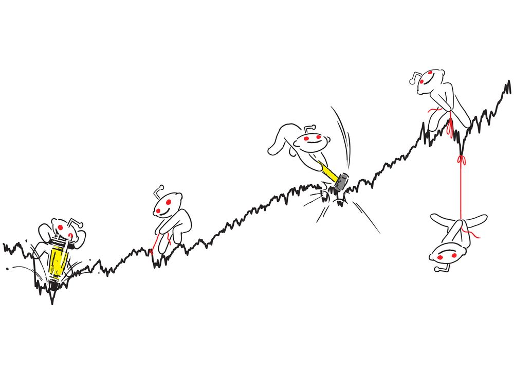

# Sentiment Analysis of "$AMC" and Technical Indicator Correlation

## Table of Contents
* [Project title](#project-title)
* [Technologies](#technologies)
* [Motivation](#motivation)
* [Overview](#overview)
* [Methodology](#methodology)
* [Results](#results)
* [Summary](#summary)

## Project title
Sentiment Analysis of "$AMC" and Technical Indicator Correlation

## Technologies
[Python](https://www.python.org/downloads/ "Download Python") 3.7.9.

## Motivation

A large audience of retail traders organized in social media platforms such as [reddit](https://www.reddit.com/) have the ability to influence stock prices. By analyzing the sentiment of these traders through their social media posts, it may be possible to anticipate stock market moves. AMC Entertainment Holdings, Inc. ($AMC)is one of the most mentioned stocks in the subreddit [r/WallStreetBets](https://www.reddit.com/r/wallstreetbets/), which is a community of stock market enthusiasts with 1.3 million members and trying to identify a fundamental narrative to justify the ascent of 'meme stocks' like AMC Entertainment is difficult. 

[please note: this project is for educational or entertainment purposes only and is not intended in any way as financial advice.]

## Overview 

Sentiment analysis is the process of detecting positive or negative sentiment in text. It’s often used by businesses to detect sentiment in social data, gauge brand reputation, and understand customers. There are two type of user-generated content available on the web: facts and opinions. Facts are statements about topics and in the current scenario, which are collectible from the Internet using search engines that index documents based on topic keywords. Opinions are user specific statement exhibiting positive or negative sentiments about a certain topic. Generally opinions are hard to categorize using keywords. Various text analysis and machine learning techniques are used to mine opinions from a document. We will explore a logistic regression approach to determine if there was a correlation between sentiment and stock price for this project using Reddit's "cashtag" symbol $ and stock symbol ("AMC") to obtain Reddit's stock sentiment and its historial stock price data.

## Methodology

### 1.Stock Price Dataset
* [AMC Entertainment Holdings, Inc. Class A Common Stock ($AMC) Historical Data](https://www.nasdaq.com/market-activity/stocks/amc/historical)
### 2.Reddit Dataset:
* [Reddit API](https://www.reddit.com/dev/api/)
* [Scrape data from Reddit using the Python Reddit API Wrapper(PRAW)](https://praw.readthedocs.io/en/latest/getting_started/authentication.html#script-application)
### 3. Required Libraries
* PRAW: Python wrapper for Reddit API [(see docs)](https://praw.readthedocs.io/en/latest/)
(see the following article on how to set up PRAW https://towardsdatascience.com/scraping-reddit-data-1c0af3040768)
* VADER : Valence Aware Dictionary for Sentiment Reasoning is a model used for text sentiment analysis that is sensitive to both polarity (positive/negative) and intensity (strength) of emotion
* 
