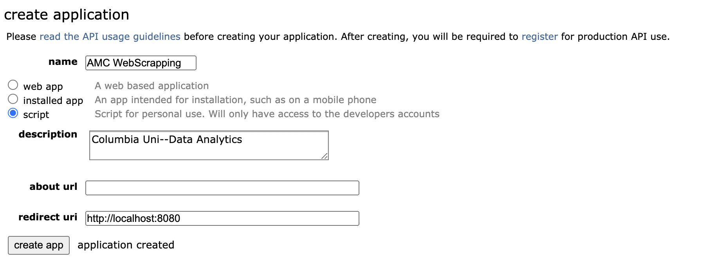
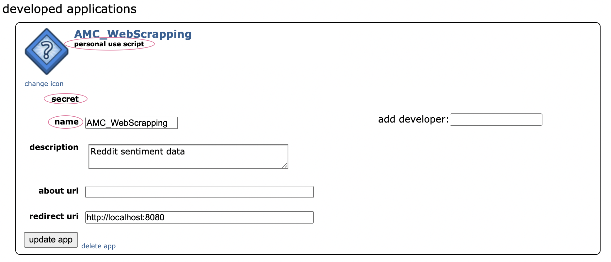
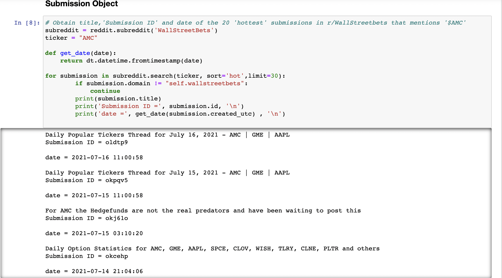
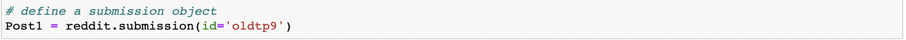
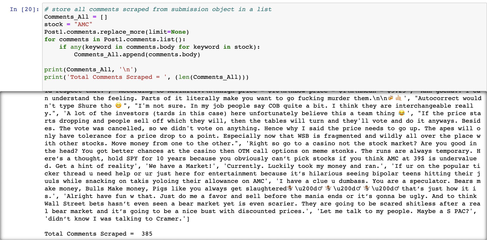

# Sentiment Analysis of "$AMC" and Technical Indicator Correlation


## Table of Contents
* [Project title](#project-title)
* [Technologies](#technologies)
* [Motivation](#motivation)
* [Overview](#overview)
* [Methodology](#methodology)
* [Results](#results)
* [Summary](#summary)


## Project title
Sentiment Analysis of "$AMC" and Technical Indicator Correlation

## Technologies
[Python](https://www.python.org/downloads/ "Download Python") 3.7.9.

## Motivation

A large audience of retail traders organized in social media platforms such as [reddit](https://www.reddit.com/) have the ability to influence stock prices. By analyzing the sentiment of these traders through their social media posts, it may be possible to anticipate stock market moves. AMC Entertainment Holdings, Inc. ($AMC)is one of the most mentioned stocks in the subreddit [r/WallStreetBets](https://www.reddit.com/r/wallstreetbets/), which is a community of stock market enthusiasts with 1.3 million members and trying to identify a fundamental narrative to justify the ascent of 'meme stocks' like AMC Entertainment is difficult. 

[please note: this project is for educational or entertainment purposes only and is not intended in any way as financial advice.]

## Overview 

Sentiment analysis is the process of detecting positive or negative sentiment in text. It is often used by businesses to detect sentiment in social data, gauge brand reputation, and understand customers. There are two type of user-generated content available on the web: facts and opinions. Facts are statements about topics and in the current scenario, which are collectible from the Internet using search engines that index documents based on topic keywords. Opinions are user specific statement exhibiting positive or negative sentiments about a certain topic and --generally, opinions are hard to categorize using keywords, so various text analysis and machine learning techniques are used to mine opinions from a document/post. In this project, we will be analysing the sentiment of comments from Subreddit(r/WallStreetBets) posts by calculate each tokenized word's polarity scores using the VADER (Valence Aware Dictionary for Sentiment Reasoning) model and analyze the correlation between stock market movements and sentiments in Reddit.

## Methodology

### 1. Stock Price Dataset
* [AMC Entertainment Holdings, Inc. Class A Common Stock ($AMC) Historical Data](https://www.nasdaq.com/market-activity/stocks/amc/historical)
### 2. Reddit Dataset:
* [Reddit API](https://www.reddit.com/dev/api/)
  <details>
  <summary>How to set up a Python API Wrapper to obtain data</summary>
  
    ## Prerequisites
    1. To access Reddit's API, you will need to create a [Reddit account](https://www.reddit.com/register/)
    2. Client ID
    3. Client Secret
    4. User Agent

    ## Getting Access
  
    1. Create an application via [App Preferences](https://www.reddit.com/prefs/apps), then select the "Are you a developer? Create another app..." at the bottom of the page.
    2. Fill out the required details: your API's **Name**, make sure to select the **'script'** option and the redirect URL with **http://localhost:8080** or **“http://www.example.com/unused/redirect/uri”** --- and click **'create app'**.
  
    ## Authentication Information
  
  iii. **Client ID('personal use script')**, **Client Secret('secret')**, and **User Agent('name')** values will be shown after creating your application-- these authentication information will be needed to create the ```praw.reddit```.
  
    ## Create a reddit connection with reddit API information


  ```python
  
  # Create praw.Reddit object with with reddit OAuth creds
  # Reddit application creds created at https://www.reddit.com/prefs/apps
  reddit = praw.Reddit(
              client_id= PRAWConfig.REDDIT_CLIENT_ID,
              client_secret= PRAWConfig.REDDIT_CLIENT_SECRET,
              user_agent= PRAWConfig.REDDIT_USER_AGENT)
   ```
  
    
  </details>
  
 * [Scrape data from Reddit using the Python Reddit API Wrapper(PRAW)](https://praw.readthedocs.io/en/latest/getting_started/authentication.html#script-application)
 
    <details>
    <summary>How to extract the comments from a Reddit subreddit post</summary>

      ## Create a submission object 
      
        (Submission ID is an assigned "ID" for a specific post on Reddit)
  
      In order to extract the comments from a subreddit post, you'll need to **create a submission objec**t and in this script-- we are looking for specific posts: the **top 30 "hot" popular posts in r/WallStreetBets, that was written by a Reddit user, and also mentions $AMC.** Subreddits can be filtered in many different ways; you can also choose to display your desired number of posts by changing ```(limit=30)``` that are ["new", "hot", "top", etc.](https://praw.readthedocs.io/en/latest/code_overview/models/subreddit.html)
  
      ## Define a submission object with submission ID 
      
      (you can also find the Submission ID directly from its url) 
  
      ## store all comments scraped from my submission object in a list 

      
      After defining a submission object, you will be able to scrape all of the comments from your desired post. 
  
      
      

  
    </details>
    
 
    
  
### 3. Required Libraries
* [PRAW](https://praw.readthedocs.io/en/stable/getting_started/installation.html): Reddit API Wrapper(PRAW)


* [VADER](https://pypi.org/project/vaderSentiment/#data): Valence Aware Dictionary for Sentiment Reasoning is a model used for text sentiment analysis that is sensitive to both polarity (positive/negative) and intensity (strength) of emotion

* [NLTK](https://www.nltk.org/install.html): Natural Language Toolkit
