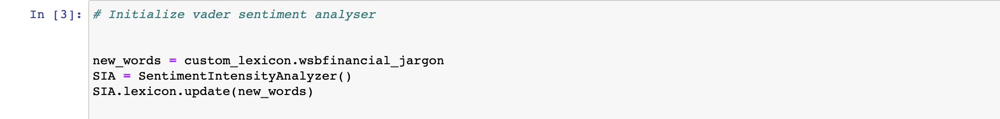
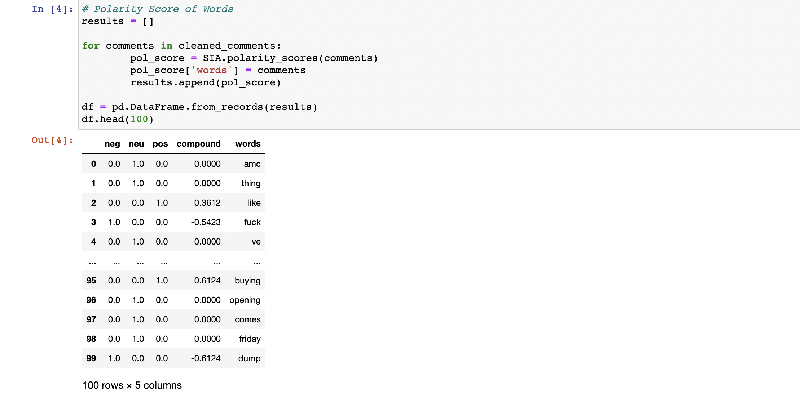

# Reddit Sentiment Analysis of "$AMC" and Technical Indicator Correlation


## Table of Contents
* [Project Title](#project-title)
* [Technologies](#technologies)
* [Motivation](#motivation)
* [Overview](#overview)
* [Required Libraries](#required-library)
* [Methodology](#methodology)
* [Results](#results)
* [Summary](#summary)
* [Future Work](#futurework)


## Project Title
Reddit Sentiment Analysis of "$AMC" and Technical Indicator Correlation

## Technologies
[Python](https://www.python.org/downloads/ "Download Python") 3.7.9.

## Motivation

A large audience of retail traders organized in social media platforms such as [reddit](https://www.reddit.com/) have the ability to influence stock prices. By analyzing the sentiment of these traders through their social media posts, it may be possible to anticipate stock market moves. AMC Entertainment Holdings, Inc. ($AMC)is one of the most mentioned stocks in the subreddit [r/WallStreetBets](https://www.reddit.com/r/wallstreetbets/), which is a community of stock market enthusiasts with 1.3 million members and trying to identify a fundamental narrative to justify the ascent of 'meme stocks' like AMC Entertainment is difficult. 

[please note: this project is for educational or entertainment purposes only and is not intended in any way as financial advice.]

## Overview 

Sentiment analysis is the process of detecting positive or negative sentiment in text. It is often used by businesses to detect sentiment in social data, gauge brand reputation, and understand customers. There are two type of user-generated content available on the web: facts and opinions. Facts are statements about topics and in the current scenario, which are collectible from the Internet using search engines that index documents based on topic keywords. Opinions are user specific statement exhibiting positive or negative sentiments about a certain topic and --generally, opinions are hard to categorize using keywords, so various text analysis and machine learning techniques are used to mine opinions from a document/post. In this project, we will be analysing the sentiment of comments from Subreddit(r/WallStreetBets) posts by calculate each tokenized word's polarity scores using the VADER (Valence Aware Dictionary for Sentiment Reasoning) model and analyze the correlation between stock market movements and sentiments in Reddit.

## Required Libraries

* [PRAW](https://praw.readthedocs.io/en/stable/getting_started/installation.html): Reddit API Wrapper(PRAW)

* [VADER](https://pypi.org/project/vaderSentiment/#data): Valence Aware Dictionary for Sentiment Reasoning is a model used for text sentiment analysis that is sensitive to both polarity (positive/negative) and intensity (strength) of emotion

* [NLTK](https://www.nltk.org/install.html): Natural Language Toolkit

* [yfinance](https://pypi.org/project/yfinance/): Yahoo! Finance market data downloader

* [Matplotlib](https://matplotlib.org/): comprehensive library for creating static, animated, and interactive visualizations in Python


## Methodology

### 1. Stock Price Dataset
* [yfinance](https://pypi.org/project/yfinance/)
### 2. Reddit Dataset:
* [Reddit API](https://www.reddit.com/dev/api/)
  <details>
  <summary>How to set up a Python API Wrapper to obtain data</summary>
  
    ## Prerequisites
    1. To access Reddit's API, you will need to create a [Reddit account](https://www.reddit.com/register/)
    2. Client ID
    3. Client Secret
    4. User Agent

    ## Getting Access
  
    1. Create an application via [App Preferences](https://www.reddit.com/prefs/apps), then select the "Are you a developer? Create another app..." at the bottom of the page.
    2. Fill out the required details: your API's **Name**, make sure to select the **'script'** option and the redirect URL with **http://localhost:8080** or **“http://www.example.com/unused/redirect/uri”** --- and click **'create app'**.
  
    ## Authentication Information
  
  iii. **Client ID('personal use script')**, **Client Secret('secret')**, and **User Agent('name')** values will be shown after creating your application-- these authentication information will be needed to create the ```praw.reddit```.
  
    ## Create a reddit connection with reddit API information


  ```python
  
  # Create praw.Reddit object with with reddit OAuth creds
  # Reddit application creds created at https://www.reddit.com/prefs/apps
  reddit = praw.Reddit(
              client_id= PRAWConfig.REDDIT_CLIENT_ID,
              client_secret= PRAWConfig.REDDIT_CLIENT_SECRET,
              user_agent= PRAWConfig.REDDIT_USER_AGENT)
   ```
  
    
  </details>
  
 * [Scrape data from Reddit using the Python Reddit API Wrapper(PRAW)](https://praw.readthedocs.io/en/latest/getting_started/authentication.html#script-application)
 
    <details>
    <summary>How to extract the comments from a Reddit subreddit post</summary>

      ## Create a submission object 
      
        (Submission ID is an assigned "ID" for a specific post on Reddit)
  
      In order to extract the comments from a subreddit post, you'll need to **create a submission object** and in this script-- we are looking for specific posts: the **top 30 "hot" popular posts in r/WallStreetBets, that was written by a Reddit user, and also mentions $AMC.** Subreddits can be filtered in many different ways; you can also choose to display your desired number of posts by changing ```(limit=30)``` that are ["new", "hot", "top", etc.](https://praw.readthedocs.io/en/latest/code_overview/models/subreddit.html)
  
      ## Define a submission object with submission ID 
      
      (you can also find the Submission ID directly from its url) 
  
      ## store all comments scraped from my submission object in a list 

      
      After defining a submission object, you will be able to scrape all of the comments from your desired post. You can also specify your "keyword" and use other filters to limit the effects of corrupt or poor data sets on the overall outcome of a machine learning model.
  
      ## Preprocess the comments
      After converting to a string object, you can either:
  
      **Option 1.** remove emojis by:
  
      ```python
      comments_without_emojis = emoji.get_emoji.regexp().sub(u'',string_raw) 
      ```
      This will simply **remove** all emojis from the comments and you will be able to perform sentiment analysis solely based on user's words. 
      
      **Option 2.** convert emojis to text:
      
      As emojis play a significant role in expressing the sentiments expecially on social media, you can replace them with the expression they represent in "plain English." (For this project, I used this method and updated specific emojis/continuous emojis(its text form) since r/Wallstreetsbets has their own way of using emojis/"slang dictionary"--e.g. "diamond hands" often referenced using :gem::open_hands:/:gem::raised_back_of_hand: are how members express their belief that their position is valuable and worth holding on to for maximum profit. [(see more common WBS words/emojis)](https://www.reuters.com/article/us-retail-trading-slang-factbox/factbox-stonks-in-washington-deciphering-reddits-wallstreetbets-lingo-idUSKBN2AI0JF) 
  
      **Option 3.** tokenize emojis:
      
      You can also tokenize emojis-- and this will split the contiguous entities when emojis are involved. This method will require you to update emoji sentiment score as well since certain emojis are considered to be positive by the oriiginal lexicon, but it is negative in WSB's dictionary, and vice versa.e.g. :fire: is considered to be negative by the original lexcon, but positive in WSB's dictionary.
  
      ## Tokenize, clean, convert into lowercase, and remove stopwords
      ``` python
      # tokenize and clean strings
      tokenizer = RegexpTokenizer('\w+|\$[\d\.]+|http\S+')
      tokenized_string = tokenizer.tokenize(emoji_converted_text)
      ```
  
      ```python
      # convert Tokens into lowercase letters
      lc_tokenized_string = [word.lower() for word in tokenized_string]
      ```
  
      ```python
      # remove stopwords *** stopwords are words that do not add much information to a sentence
      spacy_nlp = en_core_web_sm.load()
      all_sw = spacy_nlp.Defaults.stop_words
      text = lc_tokenized_string
      tokens_wosm = [word for word in text if not word in all_sw]
      
      ```
      
      These processes dramatically reduced the number of words:
      
  
  
  
      
      

  
    </details>
    
 
### 3. Technical Indicator

* [Technical Indicator Analysis: Bollinger Bands®](https://github.com/Bominkkwon/reddit-sentiment-and-stock-volatility/blob/main/technical_indicator/technical_indicator__bollinger_band.ipynb)
    <details>
    <summary>The Basics of Bollinger Bands</summary>
    A Bollinger Band® is a tool used in technical analysis. It is defined by a series of lines that are plotted two standard deviations—both positively and negatively—away from the simple moving average (SMA) of the price of a security. Bollinger Bands® identify a stock's high and low volatility points. While it can be a real challenge to forecast future prices and price cycles, volatility changes and cycles are relatively easy to identify. This is because equities alternate between periods of low volatility and high volatility—much like the **calm before the storm!** and the inevitable activity afterward.
  
  [read more about BB](https://www.schwab.com/resource-center/insights/content/bollinger-bandsr-what-they-are-and-how-to-use-them)
  
    </details>
  
### 4. Reddit Sentiment Corpus

#### > 4.1 Updating/customizing Lexicon list
I have added some WSB "financial terms" into my customized lexicon list and it is important to pick up on their inside jokes and "slangs" -- e.g. 
``` python
wsbfinancial_jargon = {
    'moon': 3,
    'buy': 3,
    'buying': 3,
    'long': 3,
    'tendies': 3,
    'diamond': 3,
    'btfd': 3,
    'dd': 3,
    'pump': 3,
    'rocket': 3,
    'gem_stone': 3,
    'smiling_face_with_open_mouth_': 3,
    'gem_stoneopen_hands': 3,
    'lambo': 3,
    'face_with_tears_of_joy': 3,
    'gem_stoneraised_back_of_hand': 3,
    'rocketfull_moon': 3,
    'locked': 3,
    'loaded': 3,
    'rebound': 1,
    'massive': 1,
    'hawkish': 2,
    'citadel': 2,
    'bounce': 2,
    'hold': 2,
    'holding': 2,
    'call': 3,
    'calls': 3,
    'squeeze': 3,
    'gain': 2,
    'gains': 2,
    'liquidate': -3,
    'liquidated': -3,
    'put': -3,
    'puts': -3,
    'bagholder': -3,
    'bagholders': -3,
    'short': -3,
    'shorts': -3,
    'sell': -3,
    'paper': -3,
    'dump': -3,
    'crying_face': -3
    
}
```

#### > 4.2 Initializing VADER sentiment Analyser
I used the VADER (Valence Aware Dictionary for Sentiment Reasoning) model to analyze the sentiment of r/Wallstreetbets submission with my [customized lexicon](https://github.com/Bominkkwon/reddit-sentiment-and-stock-volatility/blob/main/sentiment/custom_lexicon.py)-- To initialize vader sentiment analyser:



VADER's ```SIA = SentimentIntensityAnalyzer()``` takes in the comments and return a dictionary of scores in each of these four categories: 
* negative (score)
* neutral (score)
* positive (score)
* compound (score): this is the sum of positive, negative & neutral scores which is then normalized between -1(most extreme negative) and +1 (most extreme positive). **The more Compound score closer to +1, the higher the positivity of the text.** 


#### > 4.3 Understanding each word's polarity score

VADER sentimental analysis relies on a dictionary that maps lexical features to emotion intensities known as sentiment scores. The sentiment score of a text can be obtained by summing up the intensity of each word in the text. To find a single unidemnsional measure of sentiment for a given word, I measured each word's polarity score:




  * Polarity classification
    - This process will only focus on one thing: if the text expresses a positive, negative or neutral "opinion." (Here, neg — negative, neu — neutral, pos — positive.)

#### > 4.4 Adding (positive/negative) labels

The compound score is usually used as a threshold value for the analysis of the text data. (Users can even leverage the flexibility of changing the compound score(threshold value) and "label" the text data. 


Here, I followed the "standard scoring metric" and add its "label" to a new column (df['sent_label']). From this output, we can conclude that the comments on $AMC from this particular post are neutral-positive skewed. (You could also remove the neutral words, and solely analyize with the remainder of the comments.)

  <details>
  <summary>Typical scoring metric used by most of the analyzers</summary>

      1. Positive sentiment: compound score >= 0.05
      2. Neutral sentiment: (compound score > -0.05) and (compound score < 0.05)
      3. Negative sentiment: compound score <= -0.05

  (Again, this is something that users can change depends on their projects and domain knowledge.)

  </details>
  

#### > 4.5 Visualizing sentiments of comments
I generated visualizations(e.g. bar chart) to have a better understanding of our outputs. You can use its ```value_counts``` or convert it to %, and update the ylabel, accordingly. 


## Results


  AMC Stock data (07/13/2021 - 07/20/2021)           |  Subreddit Sentiment (comments from 07/15/2021 - 07/16/2021, Submission ID = oldtp9)
:-------------------------:|:-------------------------:
  |  
  
The chart on the left shows the 'historical' stock data and the bar chart on the right is the visualization of sentiments of comments we generated for the post we picked, Submission ID = oldyp9. This particular post was generated on 07/15/2021 after the market was closed and reddit users commented on this post from when the post was created, 07/15/2021, to 07/16/2021 and our analysis shows that the comments on $AMC from this particular post are **neutral-positive skewed**. $AMC closed @$36.00 on 07/15/2021 and opened @37.83 on 07/16/2021 and closed @34.96	on 07/16/2021.
 
  $AMC Bollinger Bands (sma=20)
  :-------------------------:
  
(this 'trading strategy/signal' is for educational or entertainment purposes only and is not intended in any way as financial advice)
  
The width of the band can be an indicator of its volatility-- i.e. narrower bands indicate less volatility while wider ones indicate higher volatility. Our sentiment analysis shows that from the comments: 2839 words are considered 'neutral' (80.9%), 404 words are considered 'positive' (11.5%) and 263 words are considered 'negative'(7.5%); even though the comments are neutral-positive skewed, the percentage difference between the 'positive' values and the 'negative' values were not significant(about 4%) and it could indicate users had mixed feelings about the stock and may have resulted in higher volatility (this is without taking any other economic indicators or influences into consideration, merely "analyzing" this based on the subreddit sentiment of the collected comments.) During this specific period, the bands are wider, showing higher volatility and its volume moved from 199584500 to 126277200.
  
  
## Summary
  A visual comparison of Sentiment over time vs. BB buy indicator needs more indepth analysis to assess if and how predictive sentiment is on price. 
  Link to google slides presentation: https://docs.google.com/presentation/d/1ZWNmC5B2555MLmZNFfxAD8R54t1Lw-grf5Ad72_pFV0/edit#slide=id.ge502095f44_0_47
  Link dashboard: https://docs.google.com/presentation/d/1wv-GNLssNsgwQxpzeCkczrvSTHCaUOcEbLsCJbVlwVs/edit#slide=id.p
  
## Future Work
  Such data from these social media platforms are easily manipulated by bots and sock puppet accounts; even the "hot", "new", "top" posts from this Subreddit can be manipulated by them-- it is bigger than just those orders or the price of a security getting manipulated, it could also manipulate those actual user's decision making process. It can be extremely hard to detect where bots are at work without advanced analysis tools. As detection tools get stronger, developers will look for ways around detection and as bots get more advanced, platforms will accelerate research and development to counterattack.
